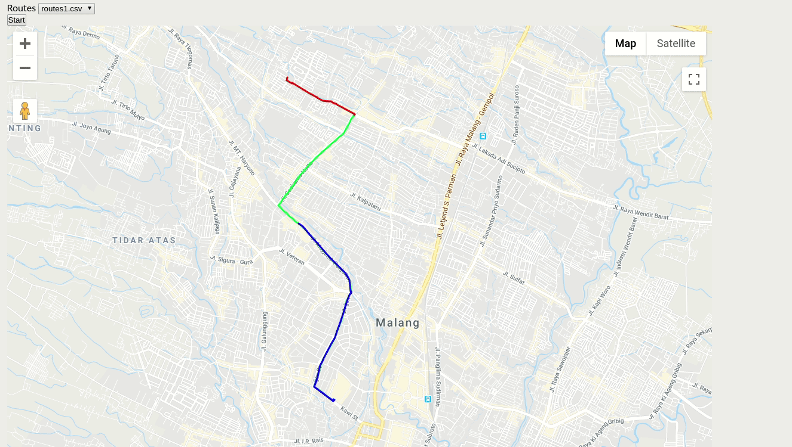

# **How to do this test**

To do this test you will need to:

- Do the above task and push your work to your private repo with name "msa-dev-screening-test"
- Invite github account 'kacank87' to your repo above to see your work
- Report your invitation to our HRD number in "+62 895-3936-87313", so our technical team would check your work

------------
------------

## **Golang Test :(Just for Backend Programmer)**

**1. Convert string to array** |  (10 Point)   
You are given a variable String  “1AB23C5678D” 
- A.	Create a function to convert from string to array string 
>         Result : [“1”,”A”,”B”, . . .]
- B.	Create a function to convert from string to array int (Show only number)
>         Result : [1,2,3, . . .]
- C.	Create a function to convert from string to array string (show only character)
>         Result : ["A","B","C", . . .]
		
		


------------
------------


**2. Calculator** |  (10 Point)  
You are given a variable String: "5+5+5*5:5" 
- create a function calculator from input string above and make sure result is true 

------------
------------

**3. JSON encode** |  (10 Point)  
You are given a variable array
```
name = ["brian","habib","malik"]
age = [25,25,24]
hobby = ["hiking","touring", "traveling"]
```
 Create a json generator for encode with array above 
 
 **Result** :
```json
     {
     name:"brian",
     age:25,
     hobby:"hiking"
     }, . . .
```

------------
------------

**4. Concurrency Task Worker** |  (60 Point)  
Implementation of a program to summarize graduate data in singapore by year of graduation and major, save in csv files per year.

>2020.csv
>2021.csv
>2022.csv

- For sources of information, use the API provided by Singapore Government Data specifically for data graduates API : [`Link`](https://api-production.data.gov.sg/v2/internal/api/datasets/d_3c55210de27fcccda2ed0c63fdd2b352/rows?limit=1000 "`Link`") (Updated 20-04-2024)
- Use the net/http package to fetch data from the provided API.
- Process raw data from API if needed.
- Implementation of a concurrent process for the process of fetching data from the API using goroutines, for illustration [>link<](https://go.dev/talks/2012/concurrency.slide#1 ">link<")
- Limit the number of concurrent processes, by applying Queue and Worker.
- Example:
>grab -concurrent_limit=2 -output=/home/yourname/csv 

------------
------------

**5. Sorting and visualization** |  (10 Point)  

A. *Design* and implement a *program* or *subprogram* which will display a simple *data array* visualization in the form of *vertical barcharts*, and in addition display each data value on the *horizontal* axis.
    
    ```
    INPUT: Numerical arrays
    [1, 4, 5, 6, 8, 2]

    OUTPUT: Vertical Barcharts

            |   
            |   
          | |  
        | | |   
      | | | |  
      | | | |  
      | | | | |
    | | | | | | 
    1 4 5 6 8 2 

    ```
B. Implement *insertion sort* algorithm, and use *subprogram* (1) to visualize each step/*steps* *sorting*

    ```
    INPUT: Numerical arrays

    [1, 4, 5, 6, 8, 2]

    OUTPUTS:

    - Sorted array (ascending)
    - Steps visualization

            |   
            |   
          | |  
        | | |   
      | | | |   
      | | | |   
      | | | | | 
    | | | | | | 
    1 4 5 6 8 2 

              | 
              | 
          |   | 
        | |   | 
      | | |   | 
      | | |   | 
      | | | | | 
    | | | | | | 
    1 4 5 6 2 8 

    ... etc ...

    ```

------------
------------

# **Vue JS Test : (Just for Frontend Programmer)**

Using :

**VUE3 &  VITE Tools**

Create a page with component :(Design with your style)

- Side Bar Menu
- Header
- Footer
- Body
- Login page
- Dashboard (menu 1)
- MAP Page (menu 3)
- Calculator Page (menu 2)


**List Menu :**

**1. Data Table**  (Menu 1)   (20 Point)  

API : [`Link`](https://api-production.data.gov.sg/v2/internal/api/datasets/d_3c55210de27fcccda2ed0c63fdd2b352/rows?limit=1000 "`Link`") (Updated 20-04-2024)

- Create a page that displays the table of an source data API
- Add search feature
- Add filter feature (By Year)

**2.  Calculator** (Menu 2)  (10 Point)  
 - Create a page that displays standard calculator 
 - Make sure the calculator is working fine

**3.  MAP** (Menu 3)  (70 Point)  
This project simulates classic problem which to calculate meeting point between two riders on given routes. Take point A and point B as route start and finish, one rider start from point A while other rider start from point B. Find location of meeting point (coordinate) and time (second) required them to met.

Task
- Implement route reader interface and must fulfill unit test.
- Implement frontend codes to simulate route path and rider traveling path.
- Calculate and display information of meeting point and time.

## Goal ilustration

